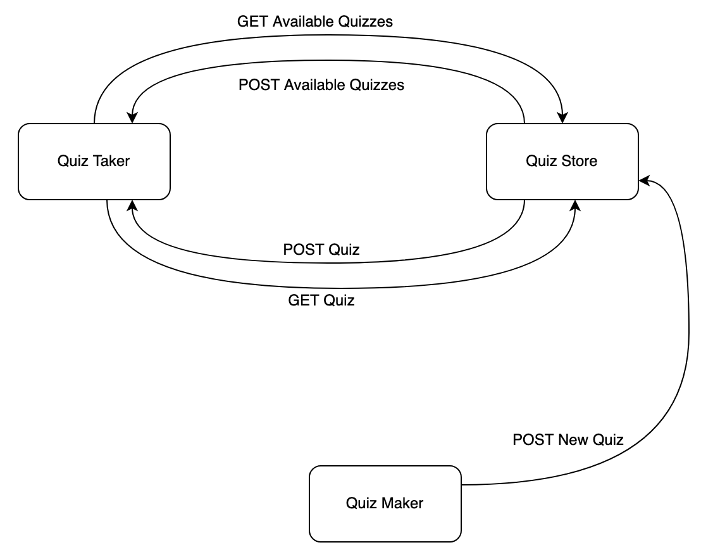

# Quarzlet

Team 03 - Aidan Lear, Devin Patel, Vish Patel

The Quarzlet cloud application allows users to create their own multiple choice quizzes and take them.

- [Quarzlet](#quarzlet)
  - [Services](#services)
  - [Structure](#structure)
  - [Installation](#installation)
  - [Run](#run)
  - [Credits](#credits)

## Services

- QuizTake: Entry point for the product. Allows user to select and take a quiz. The quiz gets scored and the results are presented to the user. Allows user to delete quizzes.
- QuizMake: Allows user to create a new quiz and add it to the database in QuizStore.
- QuizStore: Provides interfacing for database queries and communicates with QuizTake and QuizMake via HTTP requests.

## Structure

Each service runs within separate Docker containers that communicate with each other via HTTP requests.

- QuizTake: Port 8000
- QuizMake: Port 8001
- QuizStore: Port 8002

Docker compose is used to spin up all the containers and link them together.

## Installation

Initial configuration is needed before the containers can be created.  
Run the following python script in the project's root directory:

`python3 install.py`

## Run

To run the application, run the following:

`docker compose -f "docker-compose.yaml" up -d --build`

To stop the application, run the following:

`docker compose down`

Once the containers are running, you can access the site from the url  
[http://127.0.0.1:8000](http://127.0.0.1:8000)

## Credits

- Base CSS provided by [Bootstrap v4.0](https://getbootstrap.com/)
- The sidebar in QuizTake service used HTML and CSS inspired from [Bootstrap Examples](https://getbootstrap.com/docs/4.1/examples/) - [Dashboard](https://getbootstrap.com/docs/4.1/examples/dashboard)
